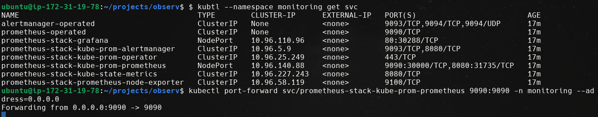
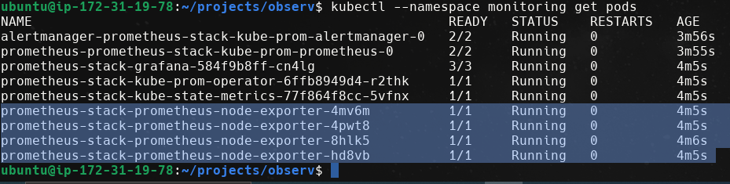
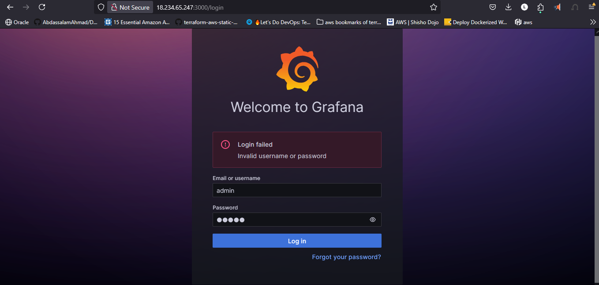
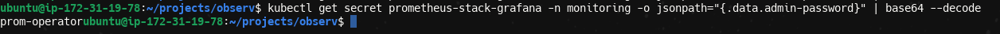
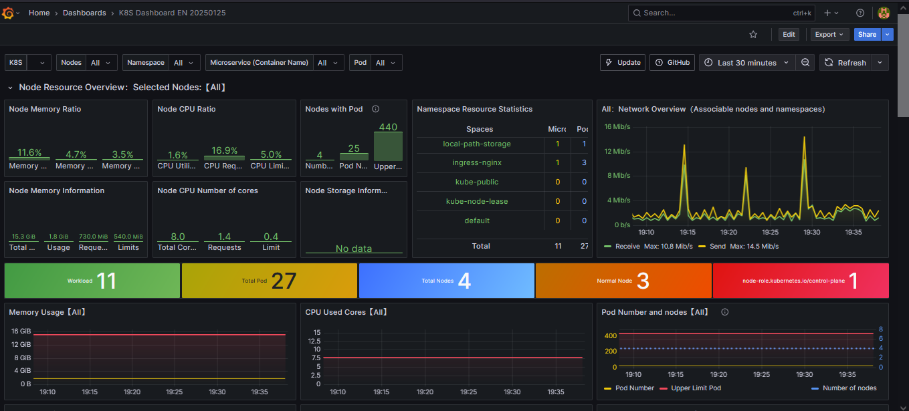

# Kubernetes Cluster Observability with Prometheus and Grafana by Using Helm

This guide provides detailed instructions for setting up a comprehensive monitoring solution for your Kubernetes cluster using Prometheus and Grafana via Helm charts.

## Table of Contents

- [Architecture Overview](#architecture-overview)
- [Prerequisites](#prerequisites)
- [Installation Steps](#installation-steps)
- [Accessing Monitoring Tools](#accessing-monitoring-tools)
- [Retrieving Grafana Credentials](#retrieving-grafana-credentials)
- [References](#references)

## Architecture Overview

The monitoring solution consists of several components:


The architecture includes:
- **Prometheus**: For metrics collection and storage
- **Grafana**: For metrics visualization and dashboarding
- **AlertManager**: For alerting based on metrics
- **Various exporters**: For collecting metrics from different sources

The diagram below shows the detailed architecture of the monitoring stack:


## Prerequisites

- A running Kubernetes cluster
- Helm installed on your machine
- kubectl configured to communicate with your cluster
- Access to create namespaces and deploy resources in your cluster

## Installation Steps

### 1. Add the Prometheus Community Helm Repository

```bash
helm repo add prometheus-community https://prometheus-community.github.io/helm-charts
```
```
helm repo update
```
```
helm repo list
```


### 2. Create a Dedicated Namespace for Monitoring

Create a separate namespace to isolate the monitoring stack:

```bash
kubectl create namespace monitoring
```

### 3. Install the Prometheus Stack using Helm

Install the kube-prometheus-stack Helm chart with customized configuration:

```bash
helm install prometheus-stack prometheus-community/kube-prometheus-stack \
  --namespace monitoring \
  --set prometheus.service.nodePort=30000 \
  --set grafna.service.nodePort=31000 \
  --set grafana.service.type=NodePort \
  --set prometheus.service.type=NodePort
```

### 4. Verify the Installation

Check that all pods in the monitoring namespace are running properly:

```bash
kubectl --namespace monitoring get pods
```


## Accessing Monitoring Tools

### Prometheus Dashboard

Forward the Prometheus service port to access the dashboard:

```bash
kubectl port-forward svc/prometheus-stack-kube-prom-prometheus 9090:9090 -n monitoring --address=0.0.0.0 &
```

You can now access the Prometheus dashboard at: http://localhost:9090



### Grafana Dashboard

Forward the Grafana service port to access the dashboard:

```bash
kubectl port-forward svc/prometheus-stack-grafana 3000:80 -n monitoring --address=0.0.0.0 &
```

You can now access the Grafana dashboard at: http://localhost:3000





## Retrieving Grafana Credentials

The default username for Grafana is `admin`. To retrieve the auto-generated password:

```bash
kubectl get secret prometheus-stack-grafana -n monitoring -o jsonpath="{.data.admin-password}" | base64 --decode
```



## References

- [Prometheus Community Helm Charts](https://github.com/prometheus-community/helm-charts)
- [Prometheus Documentation](https://prometheus.io/docs/introduction/overview/)
- [Grafana Documentation](https://grafana.com/docs/)



