# Kind Kubernetes Cluster Observability with Prometheus and Grafana by Using Helm on

This guide provides detailed instructions for setting up a comprehensive monitoring solution for your Kubernetes cluster using Prometheus and Grafana via Helm charts.

## Table of Contents

- [Architecture Overview](#architecture-overview)
  - [Key Monitoring Components](#key-monitoring-components)
  - [Kubescape for Kubernetes Master Nodes](#kubescape-for-kubernetes-master-nodes)
  - [Node Exporter for Worker Nodes](#node-exporter-for-worker-nodes)
- [Prerequisites](#prerequisites)
- [Installation Steps](#installation-steps)
- [Accessing Monitoring Tools](#accessing-monitoring-tools)
- [Retrieving Grafana Credentials](#retrieving-grafana-credentials)
- [Grafana Dashboard Configuration](#grafana-dashboard-configuration)
- [Common Metrics and Dashboards](#common-metrics-and-dashboards)
- [Alerting Configuration](#alerting-configuration)
- [References](#references)

## Architecture Overview

The monitoring solution consists of several components:

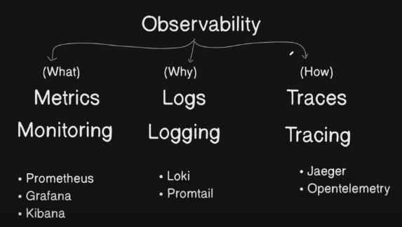

The architecture includes:
- **Prometheus**: For metrics collection and storage
- **Grafana**: For metrics visualization and dashboarding
- **AlertManager**: For alerting based on metrics
- **Various exporters**: For collecting metrics from different sources

The diagram below shows the detailed architecture of the monitoring stack:

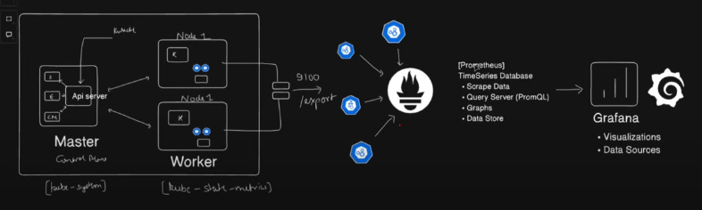

### Key Monitoring Components

#### Kubescape for Kubernetes Master Nodes

Kubescape is an open-source Kubernetes security platform that provides:
- **Security Posture Assessment**: Scans Kubernetes clusters, YAML files, and Helm charts against frameworks like NSA, MITRE ATT&CK and others
- **Risk Analysis**: Provides a risk score for compliance issues and misconfigurations
- **Compliance Reports**: Generates detailed reports on compliance with best practices and standards
- **Master Node Metrics**: Collects crucial metrics from Kubernetes control plane components including:
  - API Server performance and availability
  - Scheduler metrics
  - Controller Manager statistics
  - etcd database health and performance

Kubescape metrics are vital for monitoring the health and security posture of the control plane, allowing teams to detect and remediate security risks before they can be exploited.

#### Node Exporter for Worker Nodes

Node Exporter is a Prometheus exporter that collects hardware and OS metrics from worker nodes:
- **System Resources**: CPU, memory, disk, and network utilization
- **File System Metrics**: Disk space, I/O statistics, and file counts
- **Network Statistics**: Bandwidth usage, connection states, and network errors
- **Process Information**: Process counts, states, and resource usage
- **Kernel Metrics**: Interrupts, context switches, and boot time

Node Exporter provides comprehensive insights into the physical or virtual machines running your Kubernetes worker nodes, enabling proactive infrastructure management and capacity planning.

## Prerequisites

- A running Kubernetes cluster
- Helm installed on your machine
- kubectl configured to communicate with your cluster
- Access to create namespaces and deploy resources in your cluster

## Installation Steps

### 1. Add the Prometheus Community Helm Repository

```bash
helm repo add prometheus-community https://prometheus-community.github.io/helm-charts
```
```
helm repo update
```
```
helm repo list
```

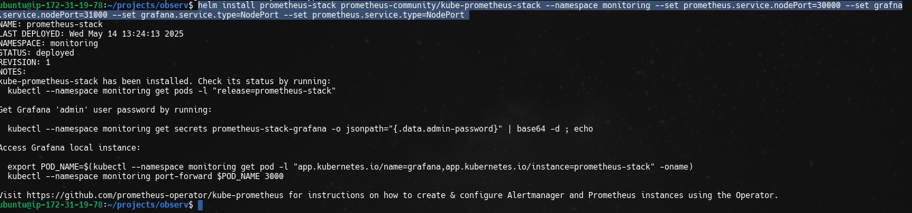

### 2. Create a Dedicated Namespace for Monitoring

Create a separate namespace to isolate the monitoring stack:

```bash
kubectl create namespace monitoring
```

### 3. Install the Prometheus Stack using Helm

Install the kube-prometheus-stack Helm chart with customized configuration:

```bash
helm install prometheus-stack prometheus-community/kube-prometheus-stack \
  --namespace monitoring \
  --set prometheus.service.nodePort=30000 \
  --set grafna.service.nodePort=31000 \
  --set grafana.service.type=NodePort \
  --set prometheus.service.type=NodePort
```

### 4. Verify the Installation

Check that all pods in the monitoring namespace are running properly:

```bash
kubectl --namespace monitoring get pods
```

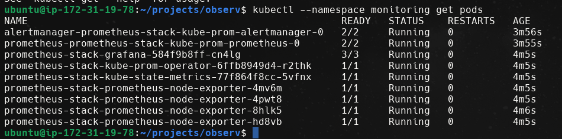

## Accessing Monitoring Tools

### Prometheus Dashboard

Forward the Prometheus service port to access the dashboard:

```bash
kubectl port-forward svc/prometheus-stack-kube-prom-prometheus 9090:9090 -n monitoring --address=0.0.0.0 &
```

You can now access the Prometheus dashboard at: http://localhost:9090

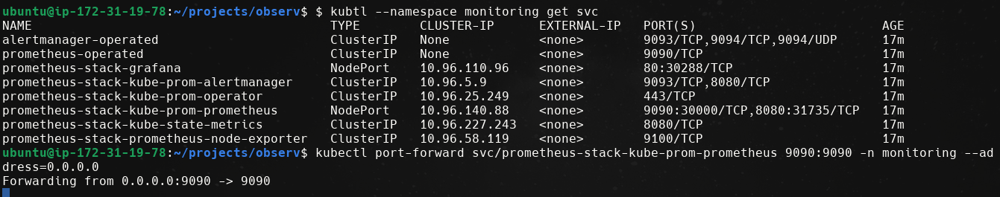

### Grafana Dashboard

Forward the Grafana service port to access the dashboard:

```bash
kubectl port-forward svc/prometheus-stack-grafana 3000:80 -n monitoring --address=0.0.0.0 &
```

You can now access the Grafana dashboard at: http://localhost:3000

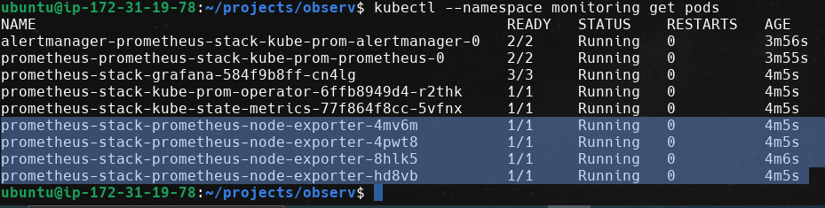

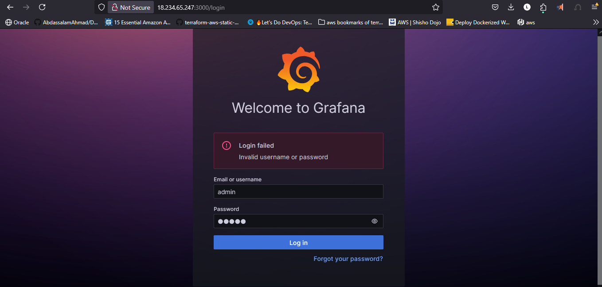

## Retrieving Grafana Credentials

The default username for Grafana is `admin`. To retrieve the auto-generated password:

```bash
kubectl get secret prometheus-stack-grafana -n monitoring -o jsonpath="{.data.admin-password}" | base64 --decode
```

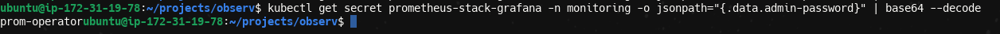


## Grafana Dashboard Configuration

After logging in to Grafana, you can configure data sources and import dashboards:

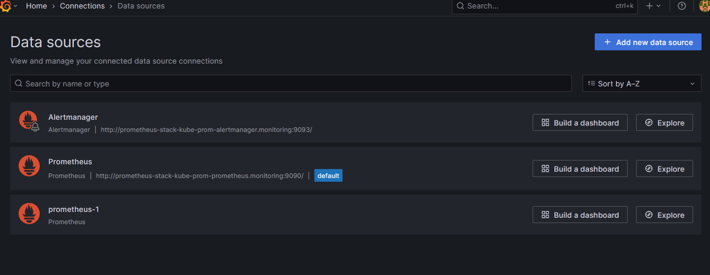

The Helm chart automatically configures Prometheus as a data source:

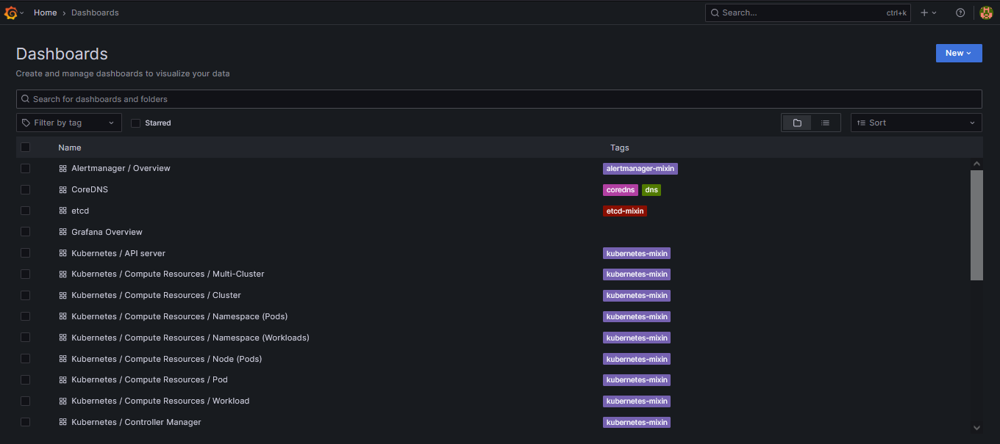

### Importing Dashboards

To import new dashboards:

1. Navigate to the dashboard import page:

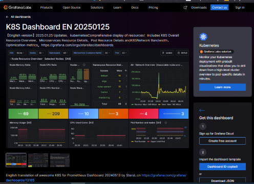

2. Import your dashboard using a dashboard ID, JSON file, or URL:

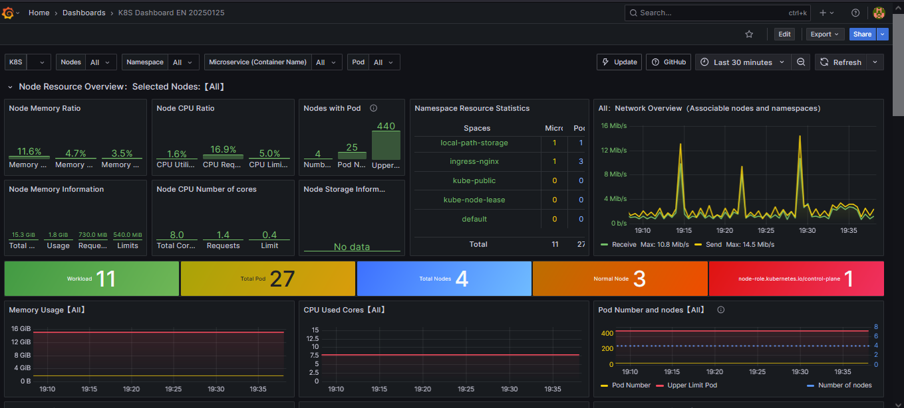


## Common Metrics and Dashboards

### Key Prometheus Metrics to Monitor

#### Kubernetes Cluster Health
- `kube_node_status_condition`: Overall node health
- `kube_pod_container_status_restarts_total`: Container restart counts
- `kube_deployment_status_replicas_available`: Available deployment replicas
- `kube_pod_container_resource_limits` and `kube_pod_container_resource_requests`: Resource allocation

#### Node Health (via Node Exporter)
- `node_cpu_seconds_total`: CPU utilization
- `node_memory_MemAvailable_bytes`: Available memory
- `node_filesystem_avail_bytes`: Disk space
- `node_network_transmit_bytes_total` and `node_network_receive_bytes_total`: Network traffic

#### Security Posture (via Kubescape)
- `kubescape_control_status`: Security control status
- `kubescape_framework_score`: Overall security score
- `kubescape_vulnerability_severity`: Detected vulnerabilities by severity
- `kubescape_misconfiguration_count`: Kubernetes misconfigurations

### Recommended Grafana Dashboards

1. **Kubernetes Cluster Overview**
   - Overall cluster status
   - Node utilization
   - Pod distribution
   - Namespace resource usage

2. **Node Exporter Full**
   - Detailed node metrics
   - CPU, memory, disk, and network details
   - System load and process information

3. **Kubernetes Security Posture (Kubescape)**
   - Security framework compliance
   - Risk scores
   - Vulnerability trends
   - Configuration drift alerts

4. **Kubernetes Pod Resources**
   - Container CPU/memory usage
   - Resource requests vs. limits
   - Pod restart events
   - Container throttling incidents

## Alerting Configuration

The kube-prometheus-stack includes pre-configured alerting rules. Some important alerts include:

- **KubePodCrashLooping**: Alerts when pods are crash looping
- **KubePodNotReady**: Alerts when pods are stuck in not-ready state
- **NodeFilesystemSpaceFillingUp**: Alerts on low disk space
- **KubeClientErrors**: Alerts on Kubernetes API client errors

## References

- [Prometheus Community Helm Charts](https://github.com/prometheus-community/helm-charts)
- [Prometheus Documentation](https://prometheus.io/docs/introduction/overview/)
- [Grafana Documentation](https://grafana.com/docs/)
- [Kubescape Documentation](https://github.com/kubescape/kubescape)
- [Node Exporter Documentation](https://github.com/prometheus/node_exporter)
- [Kubernetes Monitoring Best Practices](https://kubernetes.io/docs/tasks/debug/debug-cluster/resource-metrics-pipeline/)